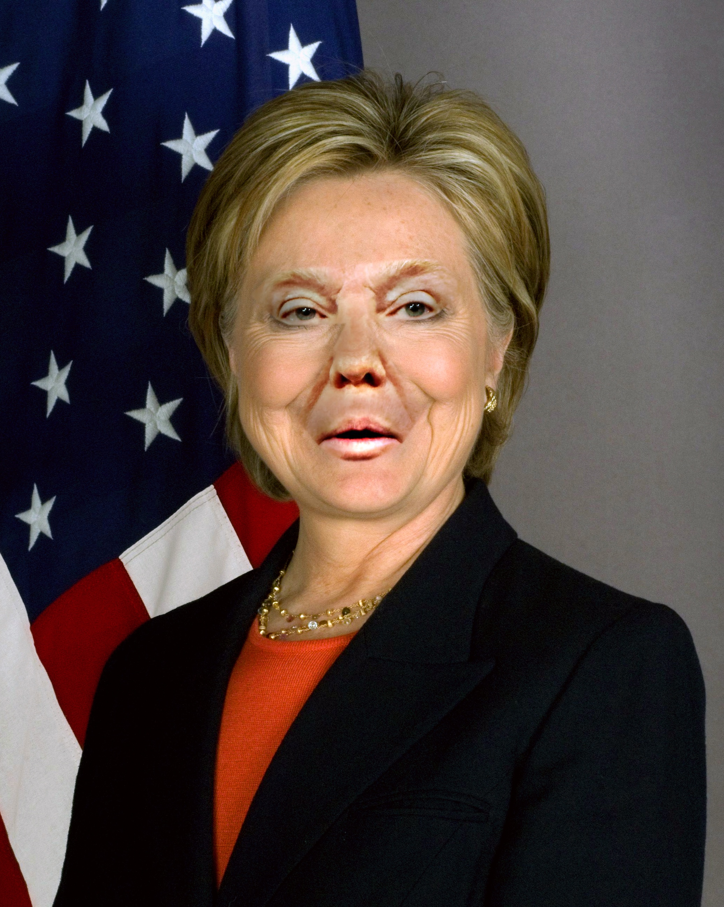

# Faceswap docker image

Swap human faces detected in pictures based on `this blog post <http://matthewearl.github.io/2015/07/28/switching-eds-with-python/>`__.
And the code comes from `this repository <https://github.com/matthewearl/faceswap/>`__.

Limitation:

* Could only be used with 2 pictures.
* There must be one and only one human face in each picture.
* High resolution pictures are recommonded.
* No glasses or hairs cover the face.

Usage::

    docker run -it --volume /folder/of/image:/images kxxoling/faceswap ./faceswap.py 1.jpg 2.jpg

Final achievement：

Another example:

